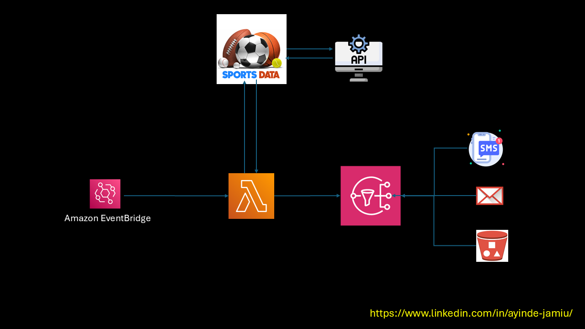

NBA Game Day Notifications / Sports Alerts System

Project Overview

This project is a real-time notification system designed to keep NBA fans informed about game-day scores via SMS or email. By leveraging AWS services like SNS, Lambda, and EventBridge, alongside NBA APIs, it provides timely updates in an efficient and secure manner. This implementation showcases the principles of cloud computing and streamlined notification delivery mechanisms.

Features

Fetches live NBA game scores from an external API.

Formats and sends game updates to subscribers through SMS/Email using Amazon SNS.

Automates notifications at scheduled intervals using Amazon EventBridge.

Adheres to security best practices with least-privilege IAM policies for all services.

Prerequisites

A free account with an API key from SportsData.io.

An AWS account with basic knowledge of AWS services and Python.

Technical Architecture

NBA API: Fetches real-time game scores.

AWS Services:

SNS: Manages notifications via SMS/Email.

Lambda: Executes the notification logic.

EventBridge: Schedules automated updates.

Programming Language: Python 3.x

Security: Implements least-privilege IAM roles for all AWS services.

Setup Instructions

1. Clone the Repository

git clone https://github.com/ifeanyiro9/game-day-notifications.git
cd game-day-notifications

2. Create an SNS Topic

Open the AWS Management Console.

Navigate to the SNS service.

Click Create Topic and select Standard as the topic type.

Name the topic (e.g., gd_topic) and note its ARN.

Click Create Topic.

3. Add Subscriptions to the SNS Topic

Open the created topic from the list.

Navigate to the Subscriptions tab and click Create subscription.

Choose a protocol:

Email: Enter a valid email address.

Click Create Subscription.

For email subscriptions, confirm via the link sent to the provided address.

4. Create the SNS Publish Policy

Open the IAM service in the AWS Management Console.

Go to Policies → Create Policy.

Select the JSON tab and paste the content of gd_sns_policy.json.

Replace REGION and ACCOUNT_ID with your AWS region and account ID.

Click Next: Review, name the policy (e.g., gd_sns_policy), and create it.

5. Create an IAM Role for Lambda

In the IAM console, go to Roles → Create Role.

Choose AWS Service and select Lambda.

Attach the following policies:

SNS Publish Policy (gd_sns_policy).

Lambda Basic Execution Role (AWSLambdaBasicExecutionRole).

Name the role (e.g., gd_role) and create it.

Save the role ARN for the Lambda function.

6. Deploy the Lambda Function

Navigate to the Lambda service in the AWS Management Console.

Click Create Function and select Author from Scratch.

Enter a function name (e.g., gd_notifications).

Choose Python 3.x as the runtime and assign the IAM role created earlier (gd_role).

Under Function Code:

Copy the content of src/gd_notifications.py.

Paste it into the inline code editor.

Add the following environment variables:

NBA_API_KEY: Your NBA API key.

SNS_TOPIC_ARN: The ARN of the SNS topic created earlier.

Click Create Function.

7. Set Up Automation with EventBridge

Navigate to the EventBridge service.

Go to Rules → Create Rule.

Select Event Source: Schedule.

Set the desired cron schedule (e.g., hourly updates).

Under Targets, choose the Lambda function (gd_notifications).

Save the rule.